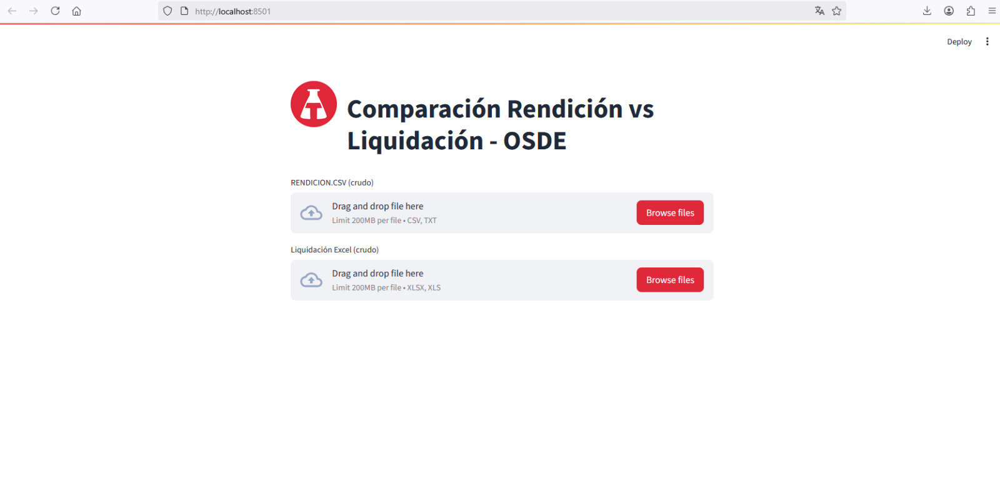
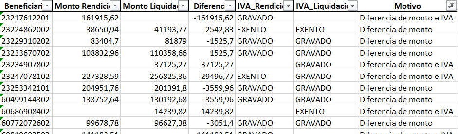

<h2>Descripción📰</h2>
Este proyecto implementa un pipeline ETL en Python que recibe dos archivos de entrada (un CSV de rendición y un Excel de liquidación), los limpia, transforma y consolida en un único archivo.

El resultado es un Excel comparativo que permite detectar:

- Registros presentes en rendición pero no en liquidación.

- Registros presentes en liquidación pero no en rendición.

- Diferencias en montos entre ambas fuentes.

- Diferencias en condición de IVA

Además, se desarrolló una interfaz en Streamlit que facilita la carga de archivos y la generación del resultado de forma intuitiva, sin necesidad de conocimientos técnicos.

<h2>Tecnologías utilizadas⚙️</h2>

-   

- 

- 

- 

- 

<h2>Instrucciones de uso🚀</h2>
<h3> 1. Clonar el repositorio </h3
                                
- git clone https://github.com/FedeBarbarroja/ETL-COMPARACION-APP.git
- cd ETL-COMPARACION-APP

<h3> 2. Instalar paquetes </h3

- pip install -r requirements.txt

<h3> 3. Ejecutar la aplicación Streamlit </h3

- python -m streamlit run Streamlit_Demo.py

<h3> 4. Subir los archivos de entrada desde la interfaz web </h3

 rendicion.csv

 liquidacion.xlsx

<h2>Capturas de pantalla📷 </h2>

<h2>Nota importante⚠️</h2>

Los datos incluidos en este repositorio fueron anonimizados. Son ejemplos ficticios utilizados únicamente con fines de demostración.

